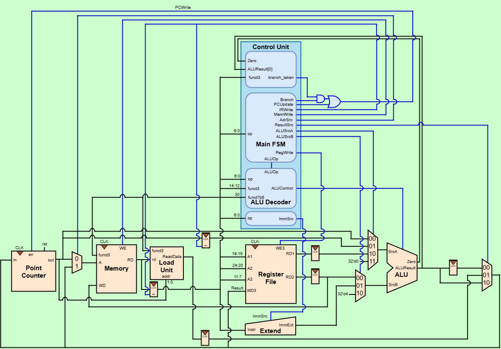

# Multicycle RISC-V CPU (RV32I)

用 Verilog 從零實作的多週期 RISC-V 處理器，支援完整 RV32I 整數指令集。
繼單週期 CPU 之後的重刻版本，重點在理解「為什麼多週期能用更少的硬體」，並為之後的 pipeline 版本鋪路。

> 設計決策與「為什麼這樣接」的細節記在 [DESIGN_NOTES.md](DESIGN_NOTES.md)。

---

## 開發進度

- [x] 零件：ALU、Register File、Extend、Memory、Load Unit、中間暫存器
- [x] Datapath 接線
- [x] Control Unit（Main FSM + ALU Decoder + Instr Decoder）
- [x] 整合模擬（RV32I 各類指令驗證通過）

**狀態：全部完成 ✅**

---

## 特色

- **完整 RV32I 指令集**：R / I / S / B / U / J 型，共 37 條指令全部支援。
- **完整的 branch 家族**：beq / bne / blt / bge / bltu / bgeu 六種，用 funct3 分流判斷 `branch_taken`。
- **完整的 load/store 寬度**：lb / lh / lw / lbu / lhu、sb / sh / sw，含符號延伸與 byte lane 選擇。
- **單一 memory、單一 ALU**：透過分 cycle 的時間多工，用比單週期更少的硬體完成同樣的指令集。
- **datapath / control 分離**：datapath 純資料通路，控制訊號全由 Control Unit 的 FSM 產生，可各自獨立驗證。
- **jal / jalr 的兩段式狀態機**：先用 `ALUOut` 算 target address，下個 cycle 再算 return address（PC+4），跟課本設計一致。

---

## 架構總覽

多週期：**一條指令拆成多個 cycle，每個 cycle 只做一件事**，同一時間機器裡只有一條指令。

```
FETCH → DECODE → ┬ MEMADR → MEMREAD → MEMWB      (load)
                 ├ MEMADR → MEMWRITE             (store)
                 ├ EXECUTER → ALUWB              (R-type)
                 ├ EXECUTEI → ALUWB              (I-type ALU)
                 ├ BEQ                           (branch，含 6 種 funct3)
                 ├ LUI → ALUWB                   (lui)
                 │ ALUWB                         (auipc，DECODE 內直接算完)
                 ├ JAL → ALUWB                   (jal)
                 └ JALR → JAL → ALUWB            (jalr)
```
不同指令用剛好夠的 cycle 數：R-type/I-type 4 cycle、branch 3 cycle、load 5 cycle、jalr 5 cycle。
 
架構圖：
 
圖中可見：
- **上半部（藍）為 Control Unit**：`Main_FSM` 依 opcode 產生所有控制訊號與 `ALUOp`，
  `ALU_Decoder` 再依 `ALUOp` + `funct3` + `funct7[5]` 產生 `ALUControl`，`Instr_Decoder` 依 opcode 產生 `ImmSrc`；
  `branch_taken` 由 `funct3` 選擇 `Zero` 或 `ALUResult[0]`，跟 `Branch` / `PCUpdate` 一起 OR 出最終的 `PCWrite`。
- **下半部（橘）為 Datapath**：Point Counter (PC)、單一 Memory、Register File、ALU、Extend，加上中間暫存器
  （OldPC / IR(Instr) / A / WriteData / ALUOut / Data(MDR)）與四個多工器（SrcA 4-to-1 / SrcB 3-to-1 / Result 3-to-1 / Adr 2-to-1）。
---
 
## 模組
 
| 模組 | 功能 |
|------|------|
| `multi_cycle_CPU.v` | 頂層，把 `Control_Unit` 和 `DataPath` 接起來。 |
| `DataPath.v` | 資料路徑，串接所有零件與 mux；控制訊號為 input，狀態訊號（`op`/`funct3`/`funct7b5`/`Zero`/`ALUResult`）為 output。 |
| `Control_Unit.v` | 控制單元頂層，內含 `Main_FSM`、`ALU_Decoder`、`Instr_Decoder`，並算出 `branch_taken` 與最終 `PCWrite`。 |
| `Main_FSM.v` | 主狀態機，13 個狀態（FETCH / DECODE / MEMADR / MEMREAD / MEMWB / MEMWRITE / EXECUTER / ALUWB / EXECUTEI / BEQ / JAL / LUI / JALR），依 opcode 決定狀態轉移與 `ALUSrcA`/`ALUSrcB`/`ResultSrc`/`ALUOp` 等訊號。 |
| `ALU_Decoder.v` | 依 `ALUOp` + `funct3` + `funct7[5]` 決定 `ALUControl`（R-type 與 I-type 兩種 opcode 分流）。 |
| `Instr_Decoder.v` | 依 opcode 決定 `ImmSrc`（I/S/B/U/J 五種）。 |
| `ALU.v` | 10 種運算，SLT 用減法器 + overflow 修正。 |
| `Register_File.v` | 32×32，2 讀 1 寫，x0 恆 0。 |
| `Extend.v` | 立即數產生，I/S/B/U/J 五種格式。 |
| `Memory.v` | 單一 memory（fetch 與 load/store 共用），byte-addressable，依 `funct3` 支援 sb/sh/sw 的 byte lane 寫入。 |
| `Load_Unit.v` | 載入延伸單元，依 `funct3` + 位址低 2 位做符號/零延伸，支援 lb/lh/lw/lbu/lhu。 |
| `register_en.v` | 帶 enable 的暫存器（PC / OldPC / IR）。 |
| `register_nen.v` | 無 enable 的暫存器（A / WriteData / MDR(Data) / ALUOut）。 |
| `mux2.v` / `mux3.v` / `mux4.v` | 多工器（Adr 用 2-to-1、SrcB / Result 用 3-to-1、SrcA 用 4-to-1）。 |
 
---
 
## 測試程式
 
`Memory.v` 的 `initial` 內建一段測試程式，依序驗證：
 
1. **R-type 全部**：add / sub / sll / slt / sltu / xor / srl / sra / or / and
2. **I-arith 全部**：addi / slli / slti / sltiu / xori / srli / srai / ori / andi
3. **Store / Load word**：sw → lw，不同 offset
4. **Branch (beq)**：相等跳 / 不相等不跳兩種情境
5. **Jump**：jal、jalr
6. **U-type**：lui、auipc
7. **Byte / Half load-store**：sb/lb/lbu、sh/lh/lhu
8. **完整 branch 家族**：bne、blt、bltu、bge、bgeu 各自 taken / not-taken 情境
執行後用 `iverilog` + testbench dump 暫存器檔案，逐一比對每行測試程式註解標註的預期值，全部吻合。
 
---
 
## 如何執行
 
### 模擬（simulation）
```bash
iverilog -o sim.out tb.v Main_FSM.v ALU_Decoder.v mux4.v Register_File.v mux2.v \
    Instr_Decoder.v register_en.v register_nen.v Memory.v Load_Unit.v ALU.v \
    Extend.v mux3.v Control_Unit.v DataPath.v multi_cycle_CPU.v
vvp sim.out
```
或用 Vivado 的 `Open Elaborated Design → Schematic` 檢視 datapath 接線。
 
---
 
## 目標指令集：RV32I（37 條，全部支援）
 
| 類型 | 指令 |
|------|------|
| R-type | add, sub, sll, slt, sltu, xor, srl, sra, or, and |
| I-type (ALU) | addi, slti, sltiu, xori, ori, andi, slli, srli, srai |
| I-type (load) | lb, lh, lw, lbu, lhu |
| I-type (jump) | jalr |
| S-type | sb, sh, sw |
| B-type | beq, bne, blt, bge, bltu, bgeu |
| U-type | lui, auipc |
| J-type | jal |
 
---
 
## 後續
 
多週期版本完成後，下一步是 **管線化 (pipeline)** 版本，
處理 data hazard（forwarding / stall）與 control hazard（branch prediction / flush）。
